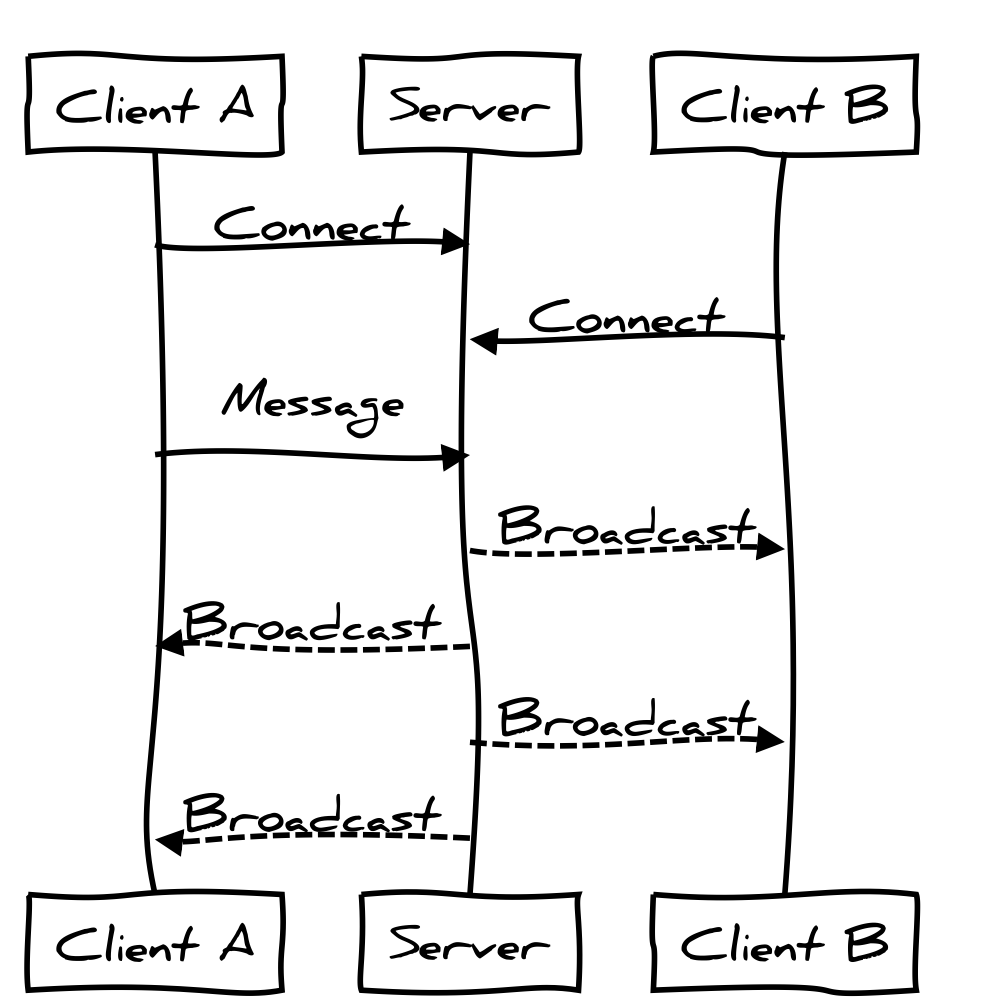

### Rails Girls TO

## Rails 5: Action Cable

##### by Mina Smart @ Shopify

^ Say hello. Introduce yourself. Tell them what you're presenting (Action Cable)

---

# Action Cable

^ I'm here to talk to you about the Rails 5 feature, action cable.
So I bet you're all wondering...

---

# Action Cable

^ What is it

---

+

Web Sockets

^ Action Cable is a rails interface to websockets. Web sockets? Those aren't
new. Yeah, they're not. But making them usable/scalable/supportable is.
But let's step back a bit. I want to explain why this is important. And why this
is a big thing for rails. To do that, I need to get talk about rails. So.

---

# What the heck is Rails?

^ What is rails? Rails is a web application server. Built using ruby, and on top
of rack. At the most basic level, rails is an HTTP server. So what is HTTP?

---

# HTTP

^ According to wikipedia: The Hypertext Transfer Protocol (HTTP) is an
application protocol for distributed, collaborative, hypermedia information
systems. HTTP is the foundation of data communication for the World Wide Web.
That's not a very concise explanation.

---

# GET, POST, PATCH, PUT, DELETE

^ What this really means for us as Rails devs is that Rails is an application
that responds to requests sent over TCP.

---

^ Every request is instigated by the client. It uses a descriptive verb.
Optionally sends some data. And the server responds.

---

# The Web

^ This is the semantic that the web is built around. This is what makes web
sockets disruptive. They change the relationship between the browser and
the server.

---

^ Web sockets provide a full duplex connection. Clients connect. Clients
message. Servers broadcast. After the initial connection, the server doesn't
have to wait for the client to instigate any action. It can do work, and notify
the client about it. It can receive messages from the client, just like with
HTTP, and tell other clients about what was sent. The canonical demo for this is
Chat.

---

# Demo

^ Show chat app. Don't take a tour of the code yet.

---

# This isn't new

^ OK, Cool. But fundamentally, nothing I've shown you is new. What makes this
interesting is doing this in rails.

---

# Socket.io

# EventMachine

^ There are existing solutions. But you don't see them in hugely wide spread use
cases. I don't think this is because there aren't a lot of use cases fro web
sockets. I think it has a lot to do with ecosystem.

---

# Ecosystem

^ Rails has one hell of an ecosystem. It's a big reason why so many of us use
it. But it's not just the ecosystem, it's the framework.

---

# Framework

- Database
- View layer
- Assets
- MVC
- Background Processing
- Mailers

^ Rails gives us a lot of stuff from the start, that none of these previous
approaches (EM, Socket.io) give us. Previous solutions are very stand alone.
There are ways to integrate these into your existing infrastructure, but they're
all home rolled and very custom. Action cable gives us a nice way to work with
everything that exists in rails. So whether you're building a new app, or adding
functionality to an existing application, Action Cable gives you a happy path to
do that.

---

# Use cases

^ There's more than just chat. There are tons of applications we interact with
all day where we're waiting for some sort of information where we're not doing
anything to instigate a server response.

---

# Waiting

^ There are so many instances where we wait. On Facebook we upload images, and
eventually get a notification when Facebook finishes processing the image. We
wait for new content to appear at the top of our many social media feeds. On the
social web we spend a lot of time waiting. A more relevant to my job example
would be checkouts. The way most checkouts work is you submit a credit card
number, the server receives, talks to an external service and sends back a
response. This can be bad. First, it busies up your rails workers, so requests
stack up. Wouldn't it be cool to move credit card processing to a background
job, and notify the client when the card charges or declines?

---

# Notifications

^ Another big thing we use web sockets for are notifications. There are a ton of
services we're connected to all the time where we may be doing something, or we
may just have a tab open, but we all want to know the moment something relevant
to us happens.

---

# Implementation

^ In a server architecture, this is difficult to implement. A lot of what drives
notification relies on externalities, so we have to build servers that don't
just respond to events, but servers that are capable of doing some work and then
announcing to the client that something has happened. I'm not even sure how
you'd do this with Rails as it stands today. Action cable makes this a little
bit easier.

---

# Let's look at some code

^ I want to show you another demo around this idea, but first let's look at the
code for the chat app. (Start with the rubby. Then move into the Ember. Explain
why I've used Ember. There are a ton of apps that use rails as an API and I
wanted to see how easy it is to do shave out one of rails' layers

---

# Servers that do work

^ Let's look at another demo, but this time where after a client connects, the
server starts doing some work that doesn't really have an end. It just starts
working and tells the client what's happening.

^ Show streaming demo, then tour code, showing how easy it is to kick off a
thread.

---

# BETA

^ I want to talk a bit about my experience building out these very simple demos.
Action Cable is still very much in beta. The first demo I build was generated
with files in wrong places. The docs didn't really explain too much about how
redis is necessary to back the whole thing. And config files included resources
that didn't exist. That said, there are tons of blogs and demos around that you
can crib from. And the docs are pretty comprehensive and loaded with some
interesting examples.

---

# Resources

- https://github.com/rails/rails/tree/master/actioncable
- https://github.com/minasmart/presentations/tree/master/rails-girls-to-action-cable/

^ Start with the action cable docs, and if you want to see more of my demo code,
or fix some of it, all of this code is on my github.

---

# Questions?

---

# Thanks!

